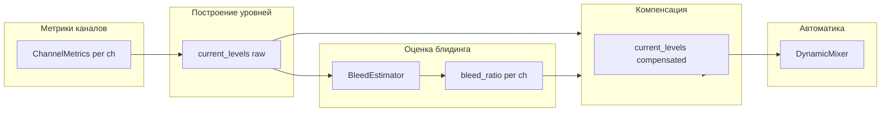

# План: защита от блидинга с компенсацией измерения без исключения канала

## Цель

- **Канал с блидингом**: остаётся в миксе, в списке каналов и в прослушивании; по нему по-прежнему считаются метрики.
- **Блинд не должен входить в измерение**: в логику автоматики (калибровка, фейдеры, баланс) передаётся не полный уровень канала, а оценка уровня **собственного** сигнала (с вычетом вклада блидинга).

Текущее поведение в [controller.py](backend/auto_fader_v2/controller.py) (строки 717–729): при детекции блидинга канал **удаляется** из `current_levels` (`del current_levels[ch]`) и не участвует в расчёте регулировок. Нужно заменить это на **компенсацию уровня** и оставить канал в `current_levels`.

---

## Архитектура

- **Вход**: те же метрики, что и сейчас (LUFS, band_energy_*, spectral_centroid, при необходимости — история envelope для временной детекции).
- **Выход**: для каждого канала с `bleed_ratio > 0` в `current_levels` записывается **компенсированный** уровень (оценка «собственного» сигнала); канал **никогда** не удаляется из `current_levels`.

---

## 1. Модуль оценки блидинга (объединённые методы)

**Расположение**: создать [backend/auto_fader_v2/core/bleed_estimator.py](backend/auto_fader_v2/core/bleed_estimator.py) (папка `core` отсутствует — её и модуль нужно добавить; текущий импорт `BleedDetector` из `core.bleed_detector` в контроллере приведёт к ошибке до появления модуля).

**Входы** (на каждый тик):

- `all_metrics: Dict[int, ChannelMetrics]` — уже есть в контроллере (lufs_*, band_energy_*, spectral_centroid).
- Опционально: краткая **история envelope/уровня** по каналам (кольцевой буфер последних N фреймов) для детекции ударов и одновременности — если не добавлять в C++, можно в первом шаге обойтись только спектральной частью и уровнем.

**Два метода (объединить в одну оценку):**

| Метод            | Данные                       | Логика                                                                                                                                                                                                                                                                                                              |
| ---------------- | ---------------------------- | ------------------------------------------------------------------------------------------------------------------------------------------------------------------------------------------------------------------------------------------------------------------------------------------------------------------- |
| **Временной**    | Одновременность ударов       | Пики envelope по каналам; если пик на канале B следует за пиком на A в окне 0–20 ms и уровень A выше B — считать вклад A в B. Либо кросс-корреляция в коротком окне (как в [phase_alignment.py](backend/phase_alignment.py) GCC-PHAT / correlate).                                                                  |
| **Спектральный** | Полосы инструмента-источника | Для каждой пары (target_ch, source_ch) и известного типа источника (kick, snare, …): задать полосы «основных частот» источника (например kick → sub+bass из `band_energy_*`). Если на target в этих полосах энергия сильно коррелирует с source и уровень source выше — увеличить долю блидинга от source в target. |

**Выход**: структура вида `BleedEstimate(channel_id, bleed_ratio: float, bleed_source_channel: Optional[int])` по каждому каналу. `bleed_ratio` в [0, 1]: доля сигнала, считающаяся блидингом (0 — только свой сигнал, 1 — только блинд).

**Объединение**: комбинировать временной и спектральный признаки в один `bleed_ratio` (например, максимум из двух или взвешенная сумма с порогами). Конфиг: пороги корреляции, доминирования, задержки удара (ms), маппинг инструмент → полосы (какие `band_energy_*` использовать).

**Конфиг**: секция `automation.auto_fader.bleed_rejection` (или расширить существующую `bleeding_rejection` в [server.py](backend/server.py) ~272–276): включение, пороги, при необходимости — маппинг инструментов на полосы. В [config/default_config.json](config/default_config.json) в `automation.auto_fader` добавить параметры (например `bleed_compensation: true`, `correlation_threshold`, `dominance_threshold`, `max_hit_delay_ms`).

---

## 2. Компенсация уровня (измерять канал, не измерять блинд)

**Формула**: из полного уровня канала получить оценку уровня «собственного» сигнала, чтобы в автоматику шло именно оно.

- Вариант в LUFS: пусть `R = bleed_ratio`. Предположение: энергия = own_energy + bleed_energy; доля своей энергии ≈ `(1 - R)`. Тогда:
  - `own_level_lufs ≈ measured_lufs + 10 * log10(max(1e-6, 1 - R))`.
- Альтернатива: консервативная линейная коррекция в dB: `own_level = measured_lufs - R * max_compensation_db` (например `max_compensation_db = 6`).

**Место внедрения**: [backend/auto_fader_v2/controller.py](backend/auto_fader_v2/controller.py), метод `_on_metrics_update`, после заполнения `current_levels` (после строки 676) и **вместо** текущего блока с `BleedDetector` и `del current_levels[ch]` (708–729):

1. Вызвать единый BleedEstimator, получить для каждого канала `bleed_ratio` (и при необходимости `bleed_source_channel`).
2. Для каналов с `bleed_ratio > 0`: перезаписать `current_levels[ch]` на компенсированное значение по выбранной формуле.
3. **Не удалять** канал из `current_levels`; не вызывать `should_skip_adjustment()` для исключения канала.
4. Опционально: в статус/логи передавать и «сырой» уровень, и компенсированный (и `bleed_ratio`), чтобы в UI можно было показывать оба.

В результате `current_levels` по-прежнему содержит все активные каналы; в [DynamicMixer.calculate_adjustments](backend/auto_fader_v2/balance/dynamic_mixer.py) и калибровку попадает уже «собственный» уровень.

---

## 3. Интеграция с существующим кодом

- **Импорт**: в контроллере заменить использование `BleedDetector` на новый модуль (например `BleedEstimator` из `core.bleed_estimator`). Либо оставить имя `BleedDetector`, но изменить контракт: вместо `should_skip_adjustment()` возвращать `bleed_ratio` и применять компенсацию в контроллере.
- **SpectralGate** в [auto_eq.py](backend/auto_eq.py) (2058–2117): не трогать; он используется для EQ/спектрального гейта. Идею доминирования по полосам можно переиспользовать в BleedEstimator через `band_energy_*` из `ChannelMetrics`.
- **Phase alignment**: [phase_alignment.py](backend/phase_alignment.py) (GCC-PHAT, correlate) — использовать только как референс реализации кросс-корреляции/задержки для временной части детекции ударов; не обязательно подключать этот класс напрямую.

---

## 4. Временная детекция (одновременность ударов)

- **Вариант без изменения C++**: в Python хранить по каждому каналу короткую историю уровней (например `lufs_momentary` или RMS за последние 50–100 ms). На каждом тике искать локальные максимумы (пики); для каждой пары каналов (источник, подозрительный) проверять: есть ли пик на подозрительном в окне 0–20 ms после пика на источнике и уровень источника выше. При выполнении — увеличивать вес блидинга от источника в целевом канале.
- **Вариант с C++**: если в будущем в shared memory или в метриках появится флаг/уровень «транзиент» или сырые сэмплы в скользящем окне — можно перенести детекцию пиков в C++ и передавать только метки «удар в канале X в момент t».

План можно реализовать поэтапно: сначала только спектральная часть + компенсация уровня (без временной), затем добавить одновременность ударов.

---

## 5. Порядок задач

1. Добавить конфиг: секция `bleed_rejection` / `bleed_compensation` в `automation.auto_fader` с параметрами (enable, correlation_threshold, dominance_threshold, max_hit_delay_ms, формула компенсации).
2. Создать `backend/auto_fader_v2/core/bleed_estimator.py`: класс, возвращающий `bleed_ratio` (и опционально источник) по `all_metrics` и, при наличии, по истории envelope; объединить спектральный критерий (полосы инструмента из `band_energy_*`) и при необходимости временной (пики по уровням).
3. В [controller.py](backend/auto_fader_v2/controller.py): заменить логику «при блидинге удалять канал» на вызов BleedEstimator и перезапись `current_levels[ch]` компенсированным уровнем; канал не удалять из `current_levels`.
4. Опционально: в статус/WebSocket отдавать для каналов с блидингом: raw_lufs, compensated_lufs, bleed_ratio, bleed_source — для отображения в UI.
5. При необходимости: добавить в контроллер кольцевой буфер уровней по каналам и реализовать детекцию пиков + одновременность для временной части (если не делалось в п.2).

После этого канал с блидингом продолжает измеряться и участвовать в миксе, но в расчётах автоматики используется оценка «собственного» сигнала, а не полный уровень с блиндом.